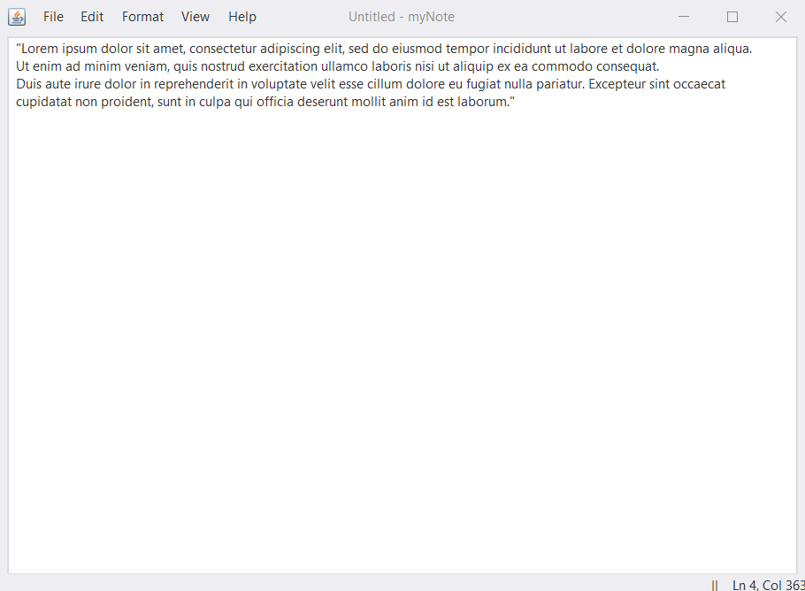
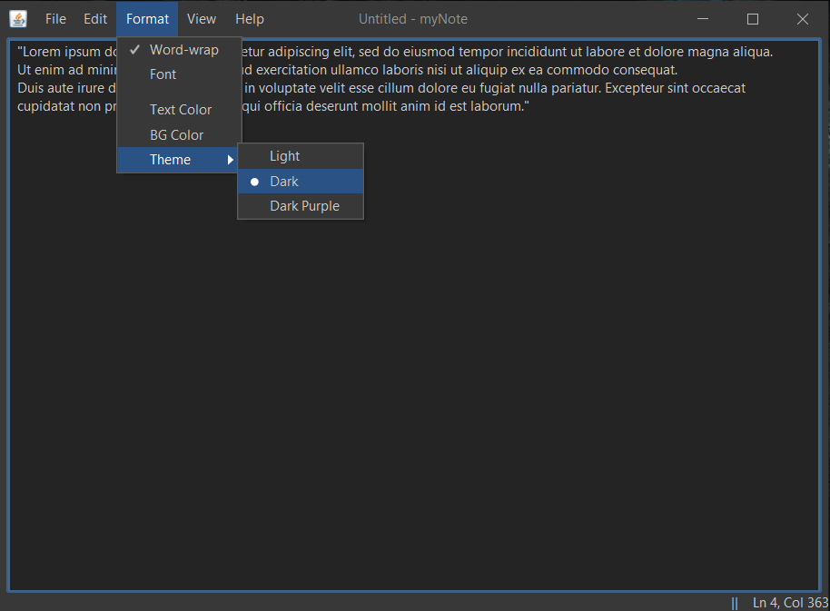

# myNote
This is a Notepad-like text-editor built in Java using AWT and Swing.

This is one of my first projects working with AWT and Swing in Java.
It has almost all the features of a regular notepad including file operations, undo/redo, formatting the editor, etc. 
There are still a few features to be added to the project: Find, Find Next, Replace and Font.

Requirements: Java Development Kit(JDK) version 15 or higher.

(Skip to the source code [here](src/com/company/).)

## Download Application:
You can directly run the application by downloading the [JAR file](myNote.jar), provided you have JDK 15 or higher.

## Screenshots

